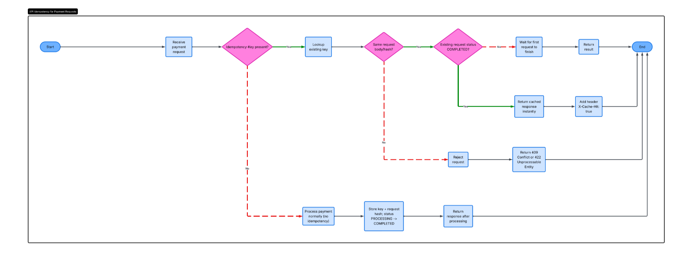

# Idempotency Gateway — Pay-Once Protocol

A FastAPI service that guarantees every payment request is processed **exactly once**, even when a client retries a request.

## Architecture Diagram



This diagram shows the request flow for the idempotency gateway:
1. Receive a payment request.
2. Verify the `Idempotency-Key` header.
3. Lookup the existing key in the in-memory store.
4. Compare request body hash to determine whether to reuse a previous response, wait for an in-flight request, or reject a conflicting duplicate.
5. Process the payment once and return the same result for future duplicate requests.

## Setup Instructions

### Local Python setup
1. Clone the repo:
   ```bash
   git clone https://github.com/YOUR_USERNAME/idempotency-gateway.git
   cd idempotency-gateway
   ```
2. Activate the local virtual environment:
   ```bash
   source env/bin/activate
   ```
3. Install dependencies:
   ```bash
   pip install -r requirements.txt
   ```
4. Start the service:
   ```bash
   uvicorn app:app --reload
   ```
5. Open the docs:
   ```text
   http://localhost:8000/docs
   ```

### Docker setup
1. Build the image:
   ```bash
   docker compose build
   ```
2. Run the container:
   ```bash
   docker compose up -d
   ```
3. Open the docs:
   ```text
   http://localhost:8001/docs
   ```

> In Docker mode, the service is exposed at `http://localhost:8001`.

## API Documentation

### `POST /process-payment`

Process a payment with an `Idempotency-Key` header.

#### Headers

| Header            | Required | Description                        |
|-------------------|----------|------------------------------------|
| `Idempotency-Key` | Yes      | Unique string per payment attempt  |
| `Content-Type`    | Yes      | `application/json`                 |

#### Request body

```json
{
  "amount": 100,
  "currency": "GHS"
}
```

#### Responses

- `201 Created` — New payment processed.
- `201 Created` — Duplicate request with same body; same response is returned.
- `422 Unprocessable Entity` — Same key used with a different body.
- `422 Unprocessable Entity` — Missing `Idempotency-Key` header.

#### Example

```bash
curl -X POST http://localhost:8000/process-payment \
  -H "Content-Type: application/json" \
  -H "Idempotency-Key: order-abc-001" \
  -d '{"amount": 100, "currency": "GHS"}'
```

```json
{
  "message": "Charged 100.0 GHS",
  "amount": 100.0,
  "currency": "GHS",
  "transaction_id": "TX-...",
  "processed_at": 1718000000.123
}
```

### `GET /health`

Check service health.

```bash
curl http://localhost:8000/health
```

```json
{
  "status": "ok",
  "service": "Idempotency Gateway"
}
```

### `GET /admin/keys`

List active idempotency keys, their status, and age. Expired keys are pruned automatically.

```bash
curl http://localhost:8000/admin/keys
```

```json
{
  "total": 2,
  "keys": [
    { "key": "order-abc-001", "status": "COMPLETED", "age_seconds": 42.3 },
    { "key": "order-abc-002", "status": "PROCESSING", "age_seconds": 1.1 }
  ]
}
```

## Design Decisions

### 1. In-memory store with `asyncio.Event`

The service uses a simple Python `dict` as the key store. Each `IdempotencyRecord` includes an `asyncio.Event` so duplicate requests can wait for the first request to complete without racing or duplicating work.

### 2. Body hashing with SHA-256

Request payloads are canonicalized with `json.dumps(..., sort_keys=True)` and hashed using SHA-256. This means matching requests are compared efficiently and safely without storing full request bodies.

### 3. Deterministic transaction IDs

The `transaction_id` is derived from the `Idempotency-Key`. This ensures the same key always produces the same transaction identifier for auditing and tracking.

### 4. Lazy expiry of idempotency keys

Expired keys are removed when admin data is requested, avoiding the need for a background cleanup thread while still preventing unbounded memory growth.

## Developer's Choice — Admin Visibility & Key Expiry

**Why:** Idempotency keys should not live forever in a real payment system. Keeping them indefinitely wastes memory and makes it harder for operators to know which keys are active.

**What I added:**
- `GET /admin/keys` to list active keys, status, and age.
- Automatic pruning of expired keys older than 24 hours.
- Operational visibility into in-flight vs completed payments.

This makes the gateway more robust for support and operations teams, not just for clients sending payment requests.
