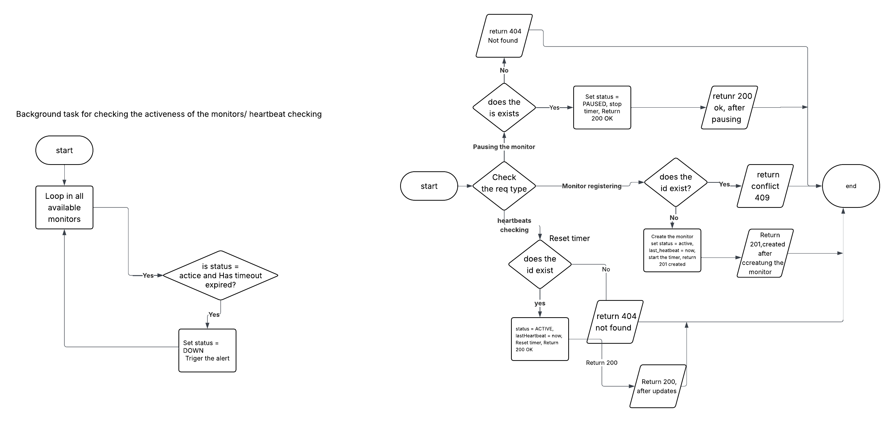

# CritMon – Dead Man's Switch API

A FastAPI backend for monitoring remote infrastructure devices such as solar farms, weather stations, and other remote assets.

## Architecture Diagram



The architecture is intentionally lightweight:
1. `POST /monitors/` registers a monitor and starts its timeout countdown.
2. `POST /heartbeat/{id}` resets the monitor's timer before the timeout expires.
3. A background task polls registered monitors and marks them `DOWN` when they miss a heartbeat.
4. `DELETE /monitors/{id}` removes a monitor entirely from the system.

## Setup Instructions

### Local Python setup
1. Clone the repo:
   ```bash
   git clone https://github.com/mugishab2020/AmaliTech-DEG-Project-based-challenges.git
   cd backend/Pulse-Check
   ```
2. Create and activate a Python virtual environment:
   ```bash
   python3 -m venv env
   source env/bin/activate
   ```
3. Install dependencies:
   ```bash
   pip install -r requirements.txt
   ```
4. Start the app:
   ```bash
   uvicorn main:app --reload --host 0.0.0.0 --port 8000
   ```
5. Open the interactive docs:
   ```text
   http://localhost:8000/docs
   ```

### Docker setup
1. Build the Docker image:
   ```bash
   docker build -t pulse-check .
   ```
2. Run the container:
   ```bash
   docker run --rm -p 8000:8000 pulse-check
   ```
3. Access Swagger UI at:
   ```text
   http://localhost:8000/docs
   ```

## API Documentation

### Monitor lifecycle

| Method   | Path                    | Description                       | Response | Notes |
| -------- | ----------------------- | --------------------------------- | -------- | ----- |
| `POST`   | `/monitors/`            | Register a new monitor            | `201`    | `409` if duplicate, `422` if invalid payload |
| `GET`    | `/monitors/`            | List all monitors                 | `200`    | |
| `GET`    | `/monitors/{id}`        | Retrieve monitor state            | `200`    | `404` if missing |
| `POST`   | `/monitors/{id}/pause`  | Pause monitor checking            | `200`    | `404` if missing |
| `POST`   | `/monitors/{id}/resume` | Resume monitor and reset timer    | `200`    | `404` if missing |
| `DELETE` | `/monitors/{id}`        | Remove monitor entirely           | `204`    | `404` if missing |

### Heartbeat

| Method | Path              | Description                    | Response | Notes |
| ------ | ----------------- | ------------------------------ | -------- | ----- |
| `POST` | `/heartbeat/{id}` | Reset the monitor countdown    | `200`    | `404` if monitor not found |

### Example payloads

**Register monitor**
```json
POST /monitors/
{
  "id": "solar-farm-01",
  "timeout": 3600,
  "webhook_url": "https://alert-service.com/hook"
}
```

**Send heartbeat**
```text
POST /heartbeat/solar-farm-01
```

**Delete monitor**
```text
DELETE /monitors/solar-farm-01
```

## The Developer's Choice: Delete Monitor Feature

I added explicit documentation for the ability to delete a monitor entirely from the system.
This feature is important because it allows operators to clean up obsolete or retired monitors and stop any further resource checks for that monitor.

The `DELETE /monitors/{id}` endpoint removes the monitor from the in-memory store and returns `204 No Content`.
It is the natural counterpart to register/list/get operations and makes the lifecycle complete.

## Running Tests

```bash
pytest tests/ -v
```

## Code structure

Pulse-Check/
  ├── app/
  │   ├── db.py              # In-memory monitor store
  │   ├── models/
  │   │   ├── monitor.py      # Monitor dataclass + Status enum
  │   │   └── schemas.py      # Pydantic request/response models
  │   ├── routes/
  │   │   ├── monitors.py     # Monitor CRUD and lifecycle operations
  │   │   └── heartbeats.py   # Heartbeat reset endpoint
  │   └── tasks/
  │       └── heartbeat_checker.py # Background timeout checker
  ├── main.py                # FastAPI application entry point
  ├── requirements.txt       # Python dependency list
  ├── Dockerfile             # Docker image build instructions
  ├── .dockerignore          # Docker build exclusions
  ├── tests/                 # Unit tests
  └── flowchat.png           # Architecture diagram
